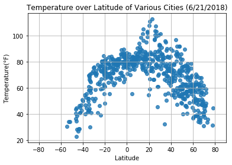

# WeatherAPI

### Analysis
* Looking at the Temperature over various cities graph, we can see that temperatures rise as the latitude of the city approachs about 18 degrees. The first though is that peak temperatures should occur at the equater, but data shows otherwise. This possibly is due to the fact that the earth is tilted.
* Though humidity for most cities is above 60%, there may be a trend with its relationship with latitude. A "W" shape takes form with two troughs at about -20 and +25 degrees latitude. Possibly showin that at this time of year is the driest seasons for cities near those latitudes.  
* Cloudiness seems to have no observable trends nor a relationship with latitude. 
* Wind Speed tends to be around 15mph or less for the majority of the cities. No correlation with latitude.


```python
# Importing Dependencies
import random
import numpy as np
import pandas as pd
from random import uniform
from citipy import citipy
import openweathermapy.core as owm
import matplotlib.pyplot as plt
import seaborn as sns

import datetime
now = datetime.datetime.now()

# Setting the OpenWeatherMap API key and the units for analysis
api_key = "f189580f4edf3f318d0c1ef6df1c1c13"
settings = {"units": "imperial", "APPID": api_key}

# Creating a set of random coordinates (x,y):(Latitude -90 to 90, Longitude -180 to 180)
# Picking 2000 variables to account for duplicates and search errors that may be found
# in the owm API
y = [round(uniform(-180,180),2) for x in np.arange(2000)]
x = [round(uniform(-90,90),2) for x in np.arange(2000)]

# Creating a dataframe from the randomly selected coordinatex
coord = pd.DataFrame({"Lat":x,"Lng":y})
coord.head()
```


<div>
<style scoped>
    .dataframe tbody tr th:only-of-type {
        vertical-align: middle;
    }

    .dataframe tbody tr th {
        vertical-align: top;
    }

    .dataframe thead th {
        text-align: right;
    }
</style>
<table border="1" class="dataframe">
  <thead>
    <tr style="text-align: right;">
      <th></th>
      <th>Lat</th>
      <th>Lng</th>
    </tr>
  </thead>
  <tbody>
    <tr>
      <th>0</th>
      <td>68.48</td>
      <td>18.44</td>
    </tr>
    <tr>
      <th>1</th>
      <td>24.12</td>
      <td>38.28</td>
    </tr>
    <tr>
      <th>2</th>
      <td>-67.37</td>
      <td>-102.98</td>
    </tr>
    <tr>
      <th>3</th>
      <td>-87.44</td>
      <td>168.90</td>
    </tr>
    <tr>
      <th>4</th>
      <td>29.31</td>
      <td>-165.39</td>
    </tr>
  </tbody>
</table>
</div>


```python
coord["Nearest City"] = ""
coord["Country Code"] = ""

# using citipy to find nearest city based on the Lat and Lng calculated above
for i,row in coord.iterrows():
    City = citipy.nearest_city(row["Lat"], row["Lng"])
    coord.loc[i,"Nearest City"] = City.city_name
    coord.loc[i,"Country Code"] = City.country_code

# dropping any duplicates to get unique list of cities, then resetting the index
coord = coord.drop_duplicates('Nearest City', keep='first').reset_index(drop=True)
print(coord.info())
coord.head()
               
```

    <class 'pandas.core.frame.DataFrame'>
    RangeIndex: 706 entries, 0 to 705
    Data columns (total 4 columns):
    Lat             706 non-null float64
    Lng             706 non-null float64
    Nearest City    706 non-null object
    Country Code    706 non-null object
    dtypes: float64(2), object(2)
    memory usage: 22.1+ KB
    None


<div>
<style scoped>
    .dataframe tbody tr th:only-of-type {
        vertical-align: middle;
    }

    .dataframe tbody tr th {
        vertical-align: top;
    }

    .dataframe thead th {
        text-align: right;
    }
</style>
<table border="1" class="dataframe">
  <thead>
    <tr style="text-align: right;">
      <th></th>
      <th>Lat</th>
      <th>Lng</th>
      <th>Nearest City</th>
      <th>Country Code</th>
    </tr>
  </thead>
  <tbody>
    <tr>
      <th>0</th>
      <td>68.48</td>
      <td>18.44</td>
      <td>setermoen</td>
      <td>no</td>
    </tr>
    <tr>
      <th>1</th>
      <td>24.12</td>
      <td>38.28</td>
      <td>umm lajj</td>
      <td>sa</td>
    </tr>
    <tr>
      <th>2</th>
      <td>-67.37</td>
      <td>-102.98</td>
      <td>punta arenas</td>
      <td>cl</td>
    </tr>
    <tr>
      <th>3</th>
      <td>-87.44</td>
      <td>168.90</td>
      <td>bluff</td>
      <td>nz</td>
    </tr>
    <tr>
      <th>4</th>
      <td>29.31</td>
      <td>-165.39</td>
      <td>kapaa</td>
      <td>us</td>
    </tr>
  </tbody>
</table>
</div>


```python
# creating a list that will contain the complete set of cities and its information
# collected from API call
dictionary =[]

# for loop based on the dataframe above will call the owm API for each city
# some cities are not found, hence the try, except to skip the cities that dont
for i,row in coord.iterrows(): 
    
    try:
        test = owm.get_current(f"{row['Nearest City']}, {row['Country Code']}", **settings)
        dictionary.append(test)
        print(f"City #{i}, {row['Nearest City']}: Success")
    except:
        print(f"----City #{i},{row['Nearest City']} not found, Skipping")
        next
    
```

    City #0, setermoen: Success
    City #1, umm lajj: Success
    City #2, punta arenas: Success
    City #3, bluff: Success
    City #4, kapaa: Success
    ----City #5,taolanaro not found, Skipping
    City #6, asilah: Success
    City #7, fortuna: Success
    City #8, vaini: Success
    City #9, yellowknife: Success
    City #10, todos santos: Success
    City #11, ixtapa: Success
    City #12, ribeira grande: Success
    City #13, bastrop: Success
    City #14, longyearbyen: Success
    City #15, jamestown: Success
    City #16, pevek: Success
    City #17, champerico: Success
    City #18, rikitea: Success
    City #19, chandur bazar: Success
    ----City #20,airai not found, Skipping
    City #21, balkanabat: Success
    City #22, acapulco: Success
    ----City #23,karaul not found, Skipping
    City #24, thunder bay: Success
    City #25, barsovo: Success
    City #26, faanui: Success
    City #27, axim: Success
    City #28, saskylakh: Success
    City #29, atuona: Success
    City #30, albany: Success
    City #31, saint-augustin: Success
    City #32, ushuaia: Success
    City #33, kaitangata: Success
    City #34, sisimiut: Success
    ----City #35,mataura not found, Skipping
    City #36, butaritari: Success
    City #37, imbituba: Success
    ----City #38,belushya guba not found, Skipping
    City #39, hilo: Success
    City #40, rajanpur: Success
    City #41, barrow: Success
    City #42, chokurdakh: Success
    City #43, palmer: Success
    City #44, grand-santi: Success
    City #45, hermanus: Success
    City #46, mahebourg: Success
    City #47, boguchany: Success
    City #48, provideniya: Success
    City #49, kampene: Success
    City #50, meulaboh: Success
    City #51, nabire: Success
    City #52, port alfred: Success
    City #53, auki: Success
    City #54, teya: Success
    City #55, cerritos: Success
    City #56, sao filipe: Success
    ----City #57,asau not found, Skipping
    City #58, hami: Success
    City #59, saldanha: Success
    City #60, touros: Success
    City #61, dikson: Success
    City #62, camacha: Success
    City #63, svetlogorsk: Success
    City #64, victoria: Success
    City #65, luxor: Success
    City #66, hasaki: Success
    City #67, puerto ayora: Success
    City #68, lorengau: Success
    ----City #69,humaita not found, Skipping
    City #70, pareora: Success
    City #71, tuktoyaktuk: Success
    City #72, bethel: Success
    City #73, lebu: Success
    City #74, chornoliztsi: Success
    City #75, vestmannaeyjar: Success
    City #76, conde: Success
    ----City #77,tsihombe not found, Skipping
    City #78, gigmoto: Success
    City #79, sorland: Success
    City #80, flinders: Success
    City #81, ketchikan: Success
    City #82, busselton: Success
    City #83, cayenne: Success
    City #84, bredasdorp: Success
    City #85, east london: Success
    City #86, nikolskoye: Success
    City #87, cherskiy: Success
    City #88, hithadhoo: Success
    City #89, bundaberg: Success
    ----City #90,maridi not found, Skipping
    City #91, esperance: Success
    City #92, souillac: Success
    City #93, aklavik: Success
    City #94, bilma: Success
    City #95, southbridge: Success
    City #96, kati: Success
    City #97, coihaique: Success
    City #98, bathsheba: Success
    City #99, cidreira: Success
    City #100, richards bay: Success
    City #101, hamilton: Success
    City #102, dunedin: Success
    City #103, saint george: Success
    City #104, arraial do cabo: Success
    City #105, marienburg: Success
    City #106, kodiak: Success
    City #107, longonjo: Success
    City #108, prince albert: Success
    City #109, iralaya: Success
    City #110, viedma: Success
    ----City #111,illoqqortoormiut not found, Skipping
    City #112, broome: Success
    City #113, bilibino: Success
    City #114, georgetown: Success
    City #115, new norfolk: Success
    City #116, tiksi: Success
    City #117, avarua: Success
    City #118, salinopolis: Success
    City #119, yanam: Success
    City #120, yebaishou: Success
    City #121, tahta: Success
    City #122, havoysund: Success
    City #123, harper: Success
    City #124, prince rupert: Success
    ----City #125,faya not found, Skipping
    City #126, coquimbo: Success
    City #127, huarmey: Success
    ----City #128,avera not found, Skipping
    City #129, koungou: Success
    City #130, port lincoln: Success
    City #131, margate: Success
    City #132, qaanaaq: Success
    ----City #133,amderma not found, Skipping
    City #134, zavoronezhskoye: Success
    City #135, lompoc: Success
    City #136, shingu: Success
    City #137, klaksvik: Success
    City #138, thompson: Success
    City #139, paamiut: Success
    City #140, lewiston: Success
    City #141, khatanga: Success
    City #142, sholokhove: Success
    City #143, ilulissat: Success
    City #144, piastow: Success
    City #145, alamos: Success
    City #146, cape town: Success
    City #147, rio gallegos: Success
    City #148, reconquista: Success
    City #149, talnakh: Success
    City #150, raul soares: Success
    City #151, constitucion: Success
    City #152, upington: Success
    City #153, dawson creek: Success
    City #154, beringovskiy: Success
    City #155, isangel: Success
    City #156, niltepec: Success
    City #157, campos belos: Success
    City #158, canatlan: Success
    City #159, tuatapere: Success
    City #160, mehamn: Success
    City #161, dwarka: Success
    City #162, dawei: Success
    City #163, la ronge: Success
    City #164, port elizabeth: Success
    City #165, buncrana: Success
    ----City #166,attawapiskat not found, Skipping
    City #167, uaua: Success
    City #168, sayansk: Success
    City #169, kurilsk: Success
    ----City #170,burica not found, Skipping
    City #171, lazaro cardenas: Success
    City #172, hobart: Success
    ----City #173,saint anthony not found, Skipping
    City #174, ponta do sol: Success
    City #175, providencia: Success
    City #176, lagoa: Success
    City #177, batemans bay: Success
    City #178, beisfjord: Success
    City #179, ust-nera: Success
    City #180, guerrero negro: Success
    City #181, terrak: Success
    City #182, lanzhou: Success
    City #183, olinda: Success
    City #184, luderitz: Success
    City #185, vardo: Success
    City #186, sligo: Success
    City #187, amparafaravola: Success
    City #188, brae: Success
    City #189, tikri: Success
    ----City #190,barentsburg not found, Skipping
    City #191, san juan: Success
    City #192, herndon: Success
    City #193, canakkale: Success
    City #194, severo-kurilsk: Success
    City #195, konstantinovsk: Success
    City #196, saint-philippe: Success
    City #197, along: Success
    City #198, bambous virieux: Success
    City #199, korla: Success
    City #200, saint-francois: Success
    City #201, nhulunbuy: Success
    ----City #202,nizhneyansk not found, Skipping
    City #203, buchanan: Success
    City #204, itarema: Success
    City #205, tasiilaq: Success
    City #206, san ramon de la nueva oran: Success
    City #207, moron: Success
    ----City #208,grand river south east not found, Skipping
    City #209, owando: Success
    City #210, oranjemund: Success
    City #211, bubaque: Success
    City #212, jammalamadugu: Success
    City #213, berea: Success
    City #214, shelburne: Success
    City #215, moquegua: Success
    City #216, grindavik: Success
    City #217, visby: Success
    ----City #218,burkhala not found, Skipping
    City #219, castro: Success
    City #220, khorixas: Success
    ----City #221,longlac not found, Skipping
    City #222, talakan: Success
    City #223, lakes entrance: Success
    City #224, leningradskiy: Success
    City #225, bajil: Success
    City #226, westport: Success
    ----City #227,saryshagan not found, Skipping
    City #228, rocha: Success
    City #229, arrecife: Success
    City #230, tazovskiy: Success
    City #231, upernavik: Success
    City #232, puerto maldonado: Success
    City #233, hue: Success
    City #234, tulsipur: Success
    City #235, kalmunai: Success
    City #236, tessalit: Success
    City #237, ambulu: Success
    City #238, krasnyy chikoy: Success
    City #239, ornskoldsvik: Success
    ----City #240,santa eulalia del rio not found, Skipping
    City #241, mago: Success
    City #242, mayumba: Success
    City #243, fukue: Success
    City #244, iskateley: Success
    ----City #245,meyungs not found, Skipping
    City #246, atar: Success
    City #247, poum: Success
    ----City #248,laureles not found, Skipping
    City #249, leiyang: Success
    City #250, vernon: Success
    City #251, kruisfontein: Success
    City #252, dudinka: Success
    City #253, geraldton: Success
    City #254, dera ghazi khan: Success
    City #255, sioux lookout: Success
    City #256, senneterre: Success
    City #257, rawson: Success
    City #258, madimba: Success
    City #259, riohacha: Success
    City #260, ewa beach: Success
    City #261, chuy: Success
    ----City #262,cheuskiny not found, Skipping
    City #263, natal: Success
    City #264, carnarvon: Success
    City #265, liwale: Success
    City #266, belmonte: Success
    City #267, gravelbourg: Success
    City #268, rio grande: Success
    City #269, gonen: Success
    ----City #270,paradwip not found, Skipping
    City #271, nanortalik: Success
    City #272, shieli: Success
    City #273, samarai: Success
    City #274, ostrovnoy: Success
    City #275, vila velha: Success
    City #276, namatanai: Success
    ----City #277,utiroa not found, Skipping
    City #278, latung: Success
    City #279, raton: Success
    City #280, tual: Success
    ----City #281,svetlyy not found, Skipping
    ----City #282,ust-kamchatsk not found, Skipping
    City #283, dire dawa: Success
    City #284, hofn: Success
    City #285, portland: Success
    City #286, siavonga: Success
    City #287, talara: Success
    City #288, narsaq: Success
    City #289, vangaindrano: Success
    City #290, yichang: Success
    City #291, mnogovershinnyy: Success
    City #292, okhotsk: Success
    ----City #293,toliary not found, Skipping
    City #294, puntarenas: Success
    City #295, marabba: Success
    City #296, tarakan: Success
    City #297, port blair: Success
    City #298, zaysan: Success
    City #299, volcan: Success
    ----City #300,halalo not found, Skipping
    City #301, impfondo: Success
    City #302, ancud: Success
    City #303, cap-chat: Success
    City #304, baikunthpur: Success
    City #305, clyde river: Success
    ----City #306,sentyabrskiy not found, Skipping
    City #307, mount isa: Success
    City #308, san luis: Success
    ----City #309,grand centre not found, Skipping
    City #310, kavieng: Success
    City #311, nuuk: Success
    City #312, stornoway: Success
    City #313, ladario: Success
    City #314, yagodnoye: Success
    City #315, tevriz: Success
    City #316, najran: Success
    City #317, bergerac: Success
    City #318, terrace: Success
    ----City #319,tubruq not found, Skipping
    City #320, gazojak: Success
    City #321, anacortes: Success
    City #322, pisco: Success
    City #323, kailua: Success
    City #324, puri: Success
    City #325, panaba: Success
    City #326, mar del plata: Success
    City #327, silkeborg: Success
    ----City #328,dolbeau not found, Skipping
    City #329, turukhansk: Success
    ----City #330,labrea not found, Skipping
    ----City #331,samusu not found, Skipping
    City #332, san patricio: Success
    City #333, comodoro rivadavia: Success
    City #334, shakhtinsk: Success
    City #335, jenison: Success
    City #336, werda: Success
    City #337, sitka: Success
    City #338, lurate caccivio: Success
    City #339, merauke: Success
    City #340, kara-tyube: Success
    ----City #341,codrington not found, Skipping
    City #342, gizo: Success
    City #343, hay river: Success
    ----City #344,gat not found, Skipping
    ----City #345,bereda not found, Skipping
    City #346, the pas: Success
    City #347, oussouye: Success
    City #348, acajutla: Success
    City #349, waldoboro: Success
    ----City #350,pilao arcado not found, Skipping
    City #351, pangai: Success
    City #352, kyren: Success
    City #353, sao joao da barra: Success
    ----City #354,hvolsvollur not found, Skipping
    ----City #355,louisbourg not found, Skipping
    City #356, dubbo: Success
    City #357, khandyga: Success
    City #358, ndele: Success
    City #359, linhai: Success
    City #360, yar-sale: Success
    City #361, semnan: Success
    ----City #362,qabis not found, Skipping
    City #363, norman wells: Success
    City #364, pervomayskoye: Success
    City #365, tres arroyos: Success
    City #366, lavrentiya: Success
    City #367, kantang: Success
    City #368, outlook: Success
    City #369, manokwari: Success
    City #370, henderson: Success
    City #371, ogulin: Success
    City #372, mosquera: Success
    City #373, port hardy: Success
    City #374, cururupu: Success
    City #375, san lorenzo: Success
    City #376, doha: Success
    City #377, ahipara: Success
    City #378, jeumont: Success
    City #379, porto novo: Success
    City #380, port keats: Success
    City #381, kuybysheve: Success
    City #382, pombas: Success
    City #383, vostok: Success
    City #384, cabo san lucas: Success
    City #385, sulina: Success
    City #386, beyneu: Success
    City #387, altamira: Success
    City #388, licata: Success
    City #389, mackay: Success
    City #390, linxia: Success
    City #391, jaguaruana: Success
    City #392, bam: Success
    City #393, saint-joseph: Success
    City #394, mpulungu: Success
    City #395, vaitape: Success
    ----City #396,taga dzong not found, Skipping
    City #397, astara: Success
    City #398, gavle: Success
    ----City #399,galiwinku not found, Skipping
    City #400, lucea: Success
    City #401, astoria: Success
    City #402, linxi: Success
    ----City #403,tumannyy not found, Skipping
    City #404, yingcheng: Success
    City #405, lamu: Success
    City #406, havre-saint-pierre: Success
    City #407, leh: Success
    City #408, nykoping: Success
    City #409, muros: Success
    City #410, seminole: Success
    City #411, livingstonia: Success
    ----City #412,abu samrah not found, Skipping
    City #413, north bend: Success
    City #414, rundu: Success
    City #415, nishihara: Success
    City #416, nome: Success
    City #417, newport: Success
    City #418, nam phong: Success
    City #419, gamba: Success
    City #420, waingapu: Success
    City #421, pangnirtung: Success
    City #422, port-gentil: Success
    City #423, dicabisagan: Success
    City #424, ilovlya: Success
    City #425, smithers: Success
    City #426, haines junction: Success
    City #427, watsa: Success
    City #428, hohhot: Success
    City #429, lannion: Success
    City #430, douglas: Success
    City #431, port moresby: Success
    City #432, koslan: Success
    ----City #433,mys shmidta not found, Skipping
    City #434, karratha: Success
    City #435, saquarema: Success
    City #436, russell: Success
    ----City #437,yei not found, Skipping
    ----City #438,rincon not found, Skipping
    City #439, lyngseidet: Success
    City #440, takoradi: Success
    City #441, varhaug: Success
    City #442, gorontalo: Success
    City #443, hobyo: Success
    City #444, zyryanka: Success
    City #445, rudbar: Success
    ----City #446,sakakah not found, Skipping
    City #447, sayyan: Success
    City #448, carutapera: Success
    City #449, bandarbeyla: Success
    City #450, vitim: Success
    City #451, springdale: Success
    City #452, rafai: Success
    City #453, staroye drozhzhanoye: Success
    City #454, charters towers: Success
    ----City #455,goderich not found, Skipping
    ----City #456,ouango not found, Skipping
    City #457, bhabua: Success
    City #458, quatre cocos: Success
    City #459, menongue: Success
    City #460, egvekinot: Success
    City #461, karlshus: Success
    City #462, nantucket: Success
    ----City #463,ruatoria not found, Skipping
    ----City #464,rawannawi not found, Skipping
    City #465, muisne: Success
    ----City #466,bengkulu not found, Skipping
    City #467, norsup: Success
    City #468, te anau: Success
    City #469, atasu: Success
    City #470, kosh-agach: Success
    ----City #471,vaitupu not found, Skipping
    City #472, nsanje: Success
    City #473, ucluelet: Success
    City #474, vila franca do campo: Success
    ----City #475,mananara not found, Skipping
    City #476, taseyevo: Success
    City #477, tocopilla: Success
    City #478, kahului: Success
    City #479, tilichiki: Success
    City #480, aykhal: Success
    City #481, weatherford: Success
    City #482, lima: Success
    City #483, jasper: Success
    City #484, prykolotne: Success
    ----City #485,ginda not found, Skipping
    City #486, rapina: Success
    City #487, ganzhou: Success
    City #488, salalah: Success
    City #489, lovozero: Success
    City #490, inhambane: Success
    City #491, mokhsogollokh: Success
    ----City #492,marzuq not found, Skipping
    City #493, cacequi: Success
    City #494, caseiu: Success
    ----City #495,caceres not found, Skipping
    ----City #496,nioro not found, Skipping
    City #497, calvia: Success
    City #498, ahuimanu: Success
    City #499, port hedland: Success
    City #500, anadyr: Success
    City #501, puerto escondido: Success
    City #502, yulara: Success
    City #503, bealanana: Success
    ----City #504,afmadu not found, Skipping
    City #505, cibitoke: Success
    City #506, methoni: Success
    ----City #507,chugunash not found, Skipping
    City #508, deputatskiy: Success
    City #509, tautira: Success
    City #510, mount gambier: Success
    City #511, buraydah: Success
    City #512, slave lake: Success
    City #513, uige: Success
    City #514, buala: Success
    City #515, taoudenni: Success
    City #516, la palma: Success
    City #517, mangan: Success
    City #518, pishva: Success
    City #519, osakarovka: Success
    City #520, pitimbu: Success
    City #521, ballina: Success
    City #522, hovd: Success
    City #523, fort nelson: Success
    City #524, marawi: Success
    City #525, padang: Success
    City #526, fare: Success
    City #527, sinnamary: Success
    City #528, chumikan: Success
    City #529, sebring: Success
    City #530, estreito: Success
    City #531, sept-iles: Success
    ----City #532,lata not found, Skipping
    ----City #533,ayan not found, Skipping
    City #534, alofi: Success
    City #535, pandan: Success
    City #536, willowmore: Success
    City #537, kuybyshevskiy zaton: Success
    City #538, marsa matruh: Success
    City #539, namibe: Success
    ----City #540,mergui not found, Skipping
    City #541, palora: Success
    City #542, abu kamal: Success
    City #543, awbari: Success
    City #544, tabou: Success
    ----City #545,shchelyayur not found, Skipping
    ----City #546,japura not found, Skipping
    City #547, zhigansk: Success
    City #548, mengyin: Success
    ----City #549,sofiysk not found, Skipping
    City #550, high level: Success
    City #551, camacupa: Success
    City #552, kodinsk: Success
    ----City #553,krasnoselkup not found, Skipping
    City #554, iqaluit: Success
    City #555, the valley: Success
    City #556, anloga: Success
    City #557, san andres: Success
    ----City #558,umzimvubu not found, Skipping
    City #559, port macquarie: Success
    City #560, howard springs: Success
    City #561, tahe: Success
    City #562, ormara: Success
    City #563, bhadra: Success
    City #564, pacifica: Success
    ----City #565,saleaula not found, Skipping
    City #566, nosy varika: Success
    ----City #567,warqla not found, Skipping
    City #568, ko samui: Success
    City #569, bemidji: Success
    City #570, praia: Success
    City #571, tutoia: Success
    City #572, dingle: Success
    City #573, nemuro: Success
    City #574, santiago: Success
    City #575, korhogo: Success
    City #576, houma: Success
    City #577, redding: Success
    City #578, aquidauana: Success
    ----City #579,wahran not found, Skipping
    City #580, port-cartier: Success
    City #581, morant bay: Success
    ----City #582,payo not found, Skipping
    City #583, mora: Success
    City #584, kolondieba: Success
    City #585, le havre: Success
    City #586, miranda: Success
    City #587, yaring: Success
    City #588, palmerston: Success
    City #589, muriwai beach: Success
    City #590, kenora: Success
    City #591, fereydun kenar: Success
    City #592, hakodate: Success
    City #593, ulladulla: Success
    City #594, knysna: Success
    City #595, nalut: Success
    City #596, manjacaze: Success
    City #597, urusha: Success
    City #598, katsuura: Success
    City #599, college: Success
    ----City #600,oga not found, Skipping
    City #601, antofagasta: Success
    City #602, sindor: Success
    City #603, viesca: Success
    City #604, praia da vitoria: Success
    City #605, douentza: Success
    City #606, kiunga: Success
    City #607, santa rosa: Success
    City #608, hastings: Success
    City #609, martinsville: Success
    City #610, kota belud: Success
    City #611, kiliya: Success
    City #612, lugovoy: Success
    City #613, antsohihy: Success
    City #614, hualmay: Success
    City #615, epe: Success
    City #616, pokrov: Success
    ----City #617,ishikari not found, Skipping
    City #618, nenagh: Success
    City #619, akureyri: Success
    City #620, markovo: Success
    City #621, alice springs: Success
    City #622, san carlos de bariloche: Success
    City #623, pimentel: Success
    City #624, uthal: Success
    City #625, babynino: Success
    City #626, diamantino: Success
    City #627, mattru: Success
    City #628, snezhnogorsk: Success
    City #629, fuerte olimpo: Success
    City #630, pathalgaon: Success
    ----City #631,hunza not found, Skipping
    City #632, pauini: Success
    City #633, flin flon: Success
    City #634, matara: Success
    City #635, bogandinskiy: Success
    City #636, umm kaddadah: Success
    City #637, bumba: Success
    City #638, salvador: Success
    City #639, yinchuan: Success
    City #640, srednekolymsk: Success
    City #641, moose factory: Success
    City #642, marsabit: Success
    City #643, torbay: Success
    City #644, nigde: Success
    City #645, biak: Success
    City #646, roma: Success
    City #647, karpogory: Success
    City #648, biltine: Success
    City #649, ocampo: Success
    ----City #650,yanan not found, Skipping
    City #651, oulu: Success
    City #652, kyzyl-suu: Success
    City #653, kununurra: Success
    City #654, williston: Success
    City #655, aanekoski: Success
    ----City #656,palabuhanratu not found, Skipping
    City #657, valdivia: Success
    ----City #658,borama not found, Skipping
    City #659, dori: Success
    City #660, nador: Success
    City #661, marion: Success
    City #662, morros: Success
    City #663, petropavlovsk-kamchatskiy: Success
    City #664, kawalu: Success
    ----City #665,severnyy not found, Skipping
    City #666, kondoa: Success
    City #667, maiduguri: Success
    City #668, grand gaube: Success
    City #669, karia: Success
    City #670, pochutla: Success
    City #671, olga: Success
    ----City #672,uwayl not found, Skipping
    City #673, toora-khem: Success
    City #674, we: Success
    City #675, pizarro: Success
    City #676, bayeux: Success
    City #677, turinsk: Success
    City #678, nouakchott: Success
    City #679, santa fe: Success
    City #680, jiuquan: Success
    City #681, celestun: Success
    ----City #682,mahon not found, Skipping
    City #683, santiago del estero: Success
    City #684, kiama: Success
    City #685, sturgeon falls: Success
    ----City #686,kazalinsk not found, Skipping
    City #687, komsomolskiy: Success
    ----City #688,san quintin not found, Skipping
    City #689, san joaquin: Success
    ----City #690,jibuti not found, Skipping
    City #691, christchurch: Success
    City #692, sri aman: Success
    ----City #693,qui nhon not found, Skipping
    City #694, arlit: Success
    City #695, alyangula: Success
    City #696, chorozinho: Success
    City #697, seoul: Success
    City #698, pontianak: Success
    City #699, chara: Success
    City #700, zdvinsk: Success
    City #701, valparaiso: Success
    City #702, mountain home: Success
    City #703, ulaanbaatar: Success
    City #704, pokhara: Success
    City #705, samarinda: Success


```python
City=[]
Country=[]
Lat=[]
Temp=[]
Humidity=[]
Cloudiness=[]
Windspeed=[]

# From the dictionary created, making a dataframe of desired information
for x in dictionary:
    City.append(x["name"])
    Country.append(x["sys"]["country"])
    Lat.append(x["coord"]["lat"])
    Temp.append(x["main"]["temp"])
    Humidity.append(x["main"]["humidity"])
    Cloudiness.append(x["clouds"]["all"])
    Windspeed.append(x["wind"]["speed"])

completeDF = pd.DataFrame({"City":City,
                           "Country":Country,
                           "Latitude":Lat,
                           "Temperature":Temp,
                           "Humidity":Humidity,
                           "Cloudiness":Cloudiness,
                           "Windspeed":Windspeed,
                          })
completeDF=completeDF[["City","Country","Latitude", "Temperature","Humidity","Cloudiness","Windspeed"]]

completeDF.to_csv("Outputs/WeatherData.csv")
completeDF.info()
completeDF.head()
```

    <class 'pandas.core.frame.DataFrame'>
    RangeIndex: 615 entries, 0 to 614
    Data columns (total 7 columns):
    City           615 non-null object
    Country        615 non-null object
    Latitude       615 non-null float64
    Temperature    615 non-null float64
    Humidity       615 non-null int64
    Cloudiness     615 non-null int64
    Windspeed      615 non-null float64
    dtypes: float64(3), int64(2), object(2)
    memory usage: 33.7+ KB


<div>
<style scoped>
    .dataframe tbody tr th:only-of-type {
        vertical-align: middle;
    }

    .dataframe tbody tr th {
        vertical-align: top;
    }

    .dataframe thead th {
        text-align: right;
    }
</style>
<table border="1" class="dataframe">
  <thead>
    <tr style="text-align: right;">
      <th></th>
      <th>City</th>
      <th>Country</th>
      <th>Latitude</th>
      <th>Temperature</th>
      <th>Humidity</th>
      <th>Cloudiness</th>
      <th>Windspeed</th>
    </tr>
  </thead>
  <tbody>
    <tr>
      <th>0</th>
      <td>Setermoen</td>
      <td>NO</td>
      <td>68.86</td>
      <td>48.20</td>
      <td>93</td>
      <td>75</td>
      <td>4.70</td>
    </tr>
    <tr>
      <th>1</th>
      <td>Umm Lajj</td>
      <td>SA</td>
      <td>25.02</td>
      <td>96.83</td>
      <td>47</td>
      <td>0</td>
      <td>19.26</td>
    </tr>
    <tr>
      <th>2</th>
      <td>Punta Arenas</td>
      <td>CL</td>
      <td>-53.16</td>
      <td>33.91</td>
      <td>100</td>
      <td>40</td>
      <td>19.46</td>
    </tr>
    <tr>
      <th>3</th>
      <td>Bluff</td>
      <td>NZ</td>
      <td>-46.60</td>
      <td>43.73</td>
      <td>100</td>
      <td>92</td>
      <td>6.17</td>
    </tr>
    <tr>
      <th>4</th>
      <td>Kapaa</td>
      <td>US</td>
      <td>22.08</td>
      <td>74.07</td>
      <td>83</td>
      <td>20</td>
      <td>7.29</td>
    </tr>
  </tbody>
</table>
</div>


```python
# Plotting using the complete dataframe, then saving the graphs as images 

sns.regplot(x=completeDF["Latitude"],y=completeDF["Temperature"],fit_reg=False)
plt.xlim(-90,90)
plt.ylabel("Temperature(°F)")
plt.title(f"Temperature over Latitude of Various Cities ({now.month}/{now.day}/{now.year})")
plt.grid()

plt.savefig("Outputs/Temperature.jpeg")
```





```python
sns.regplot(x=completeDF["Latitude"],y=completeDF["Humidity"],fit_reg=False)
plt.xlim(-90,90)
plt.ylabel("Humidity Percentage")
plt.title(f"Humidity over Latitude of Various Cities ({now.month}/{now.day}/{now.year})")
plt.grid()

plt.savefig("Outputs/Humidity.jpeg")
```


```python
sns.regplot(x=completeDF["Latitude"],y=completeDF["Cloudiness"],fit_reg=False)
plt.xlim(-90,90)
plt.ylabel("Percent Cloudy")
plt.title(f"Cloudiness over Latitude of Various Cities ({now.month}/{now.day}/{now.year})")
plt.grid()

plt.savefig("Outputs/Cloudiness.jpeg")
```


```python
sns.regplot(x=completeDF["Latitude"],y=completeDF["Windspeed"],fit_reg=False)
plt.xlim(-90,90)
plt.ylabel("Wind Speed(mph)")
plt.title(f"Wind Speed over Latitude of Various Cities ({now.month}/{now.day}/{now.year})")
plt.grid()

plt.savefig("Outputs/Windspeed.jpeg")
```


