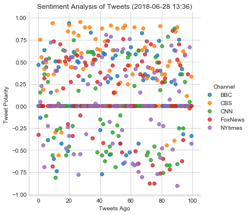
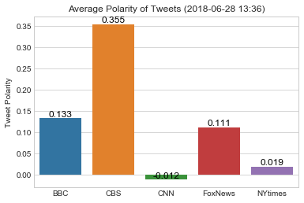

# News Mood on Twitter

## Analysis

* Although tweet polarity may change as new tweets are continually introduced, based on the current standandings of five news channels(BBC, CBS, CNN, Fox, NYtimes) CBS has the highest aveage polarity score. Meaning their tweets hold the most "possitive" connotation. This is due to the fact that some of their individual tweets scored highest polarity scores, while only a handfull fell below the neutral line(compound polarity score of 0).
* CNN and NYTimes have on average the most neutral tweets. Where CNN have many tweets both above and below the neural line, averaging out to slighly below zero. Comared to the rest of the news channels, CNN has the most tweets below zero. NY times has alot more neutral tweets with fewer scattered above and below the neutral line.
* BCC and Fox both have possitive sentiment poliarity of their tweets, averaging to about half that of CBS, even though Fox holds a few tweets schoring the most negative compound polarity. 


```python
# Dependencies
import tweepy
import numpy as np
import pandas as pd
from datetime import datetime
import matplotlib.pyplot as plt
import seaborn as sns

# Import and Initialize Sentiment Analyzer
from vaderSentiment.vaderSentiment import SentimentIntensityAnalyzer
analyzer = SentimentIntensityAnalyzer()

# Twitter API Keys
consumer_key = "9klQf5Xezx4LUTF8i6keuU1Uj"
consumer_secret = "zPgfwZX4QyqpAE4QC8InKqnyBe434Wwx7MfPcgVjanriH4Pgdx"
access_token = "1009240407920783360-2l9tNXyymnHeg9u403p9h0aKLHaI3g"
access_token_secret = "Qr9Rcjc8YKe8pLzUPx95XSIjbg50EGOQofD3TMFSW5Pxp"

# Setup Tweepy API Authentication
auth = tweepy.OAuthHandler(consumer_key, consumer_secret)
auth.set_access_token(access_token, access_token_secret)
api = tweepy.API(auth, parser=tweepy.parsers.JSONParser())
```


```python
# Target Accounts
target_user = ["@BBC", "@CBS", "@CNN", "@FoxNews", "@NYtimes"]

# Innitialize list and Dictionary that will hold data collected from tweepy API calls
# Experimenting with dictionaries vs lists
datasetCompound = {}
datasetSenti = []

for target in target_user:

    # Variables for holding sentiments
    compound_list = []

    # 5 Pages 1 to 6, due to fact that each page holds 20 tweets
    for x in range(1,6):

        # Run search around each tweet. Using api.user_timeline, vs api.search. 
        # Various ways to get the 100 tweets, api.search was yielding some channels with 
        # below 100..... api.search(target,count=100)
        public_tweets = api.user_timeline(target, page=x)
        
        # Analyze each tweet and collect information. Experimenting 
        for tweet in public_tweets:
            results = analyzer.polarity_scores(tweet["text"])
            
            comp = results["compound"]
            pos = results["pos"]
            neu = results["neu"]
            neg = results["neg"]

            compound_list.append(comp)
    
            Dict = {
                            "Channel": target.split("@")[1],
                            "Text": tweet["text"],
                            "Date": tweet["created_at"],
                            "Compound": (comp),
                            "Positive": (pos),
                            "Neutral": (neu),
                            "Negative": (neg)
            }
    
            datasetSenti.append(Dict)
    
    compoundDict = {
        f"{target.split('@')[1]}": (compound_list)
        }
    
#     compoundDict = {
#     "Channel":target,
#     "Compound Score": (compound_list)
#     }


    datasetCompound.update(compoundDict)
```


```python

completeDF = pd.DataFrame(datasetSenti)
completeDF = completeDF[["Channel", "Text", "Date", "Compound", "Positive", "Neutral", "Negative"]]

completeDF.to_csv("Outputs/TweetData.csv")

completeDF.head()
```


<div>
<style scoped>
    .dataframe tbody tr th:only-of-type {
        vertical-align: middle;
    }

    .dataframe tbody tr th {
        vertical-align: top;
    }

    .dataframe thead th {
        text-align: right;
    }
</style>
<table border="1" class="dataframe">
  <thead>
    <tr style="text-align: right;">
      <th></th>
      <th>Channel</th>
      <th>Text</th>
      <th>Date</th>
      <th>Compound</th>
      <th>Positive</th>
      <th>Neutral</th>
      <th>Negative</th>
    </tr>
  </thead>
  <tbody>
    <tr>
      <th>0</th>
      <td>BBC</td>
      <td>RT @bbcthree: Housemates who never take the bi...</td>
      <td>Thu Jun 28 16:13:35 +0000 2018</td>
      <td>0.4696</td>
      <td>0.139</td>
      <td>0.861</td>
      <td>0.000</td>
    </tr>
    <tr>
      <th>1</th>
      <td>BBC</td>
      <td>Half of all people who drown never intended to...</td>
      <td>Thu Jun 28 16:00:25 +0000 2018</td>
      <td>-0.1280</td>
      <td>0.115</td>
      <td>0.753</td>
      <td>0.133</td>
    </tr>
    <tr>
      <th>2</th>
      <td>BBC</td>
      <td>RT @BBC6Music: If you could pick just one Eryk...</td>
      <td>Thu Jun 28 15:52:28 +0000 2018</td>
      <td>0.0000</td>
      <td>0.000</td>
      <td>1.000</td>
      <td>0.000</td>
    </tr>
    <tr>
      <th>3</th>
      <td>BBC</td>
      <td>RT @BBCR1: TONIGHT Elton John (@eltonofficial)...</td>
      <td>Thu Jun 28 15:22:37 +0000 2018</td>
      <td>0.4963</td>
      <td>0.188</td>
      <td>0.761</td>
      <td>0.052</td>
    </tr>
    <tr>
      <th>4</th>
      <td>BBC</td>
      <td>Narcissists might be irritating attention seek...</td>
      <td>Thu Jun 28 13:00:23 +0000 2018</td>
      <td>0.6369</td>
      <td>0.234</td>
      <td>0.676</td>
      <td>0.090</td>
    </tr>
  </tbody>
</table>
</div>


```python
# Can also use the table above, and do a pd.groupby
# Convert sentiments to DataFrame
for target in target_user:
    print(f"{target.split('@')[1]}:{len(datasetCompound[target.split('@')[1]])}")
DF = pd.DataFrame(datasetCompound)

DF.to_csv("Outputs/TweetPolarity.csv")

DF.head()
```

    BBC:100
    CBS:100
    CNN:100
    FoxNews:100
    NYtimes:100


<div>
<style scoped>
    .dataframe tbody tr th:only-of-type {
        vertical-align: middle;
    }

    .dataframe tbody tr th {
        vertical-align: top;
    }

    .dataframe thead th {
        text-align: right;
    }
</style>
<table border="1" class="dataframe">
  <thead>
    <tr style="text-align: right;">
      <th></th>
      <th>BBC</th>
      <th>CBS</th>
      <th>CNN</th>
      <th>FoxNews</th>
      <th>NYtimes</th>
    </tr>
  </thead>
  <tbody>
    <tr>
      <th>0</th>
      <td>0.4696</td>
      <td>0.0000</td>
      <td>0.0000</td>
      <td>-0.3245</td>
      <td>0.0000</td>
    </tr>
    <tr>
      <th>1</th>
      <td>-0.1280</td>
      <td>0.7574</td>
      <td>0.1531</td>
      <td>0.0000</td>
      <td>0.0516</td>
    </tr>
    <tr>
      <th>2</th>
      <td>0.0000</td>
      <td>0.5574</td>
      <td>0.0000</td>
      <td>0.0000</td>
      <td>0.2263</td>
    </tr>
    <tr>
      <th>3</th>
      <td>0.4963</td>
      <td>0.1867</td>
      <td>0.0000</td>
      <td>0.0000</td>
      <td>-0.4449</td>
    </tr>
    <tr>
      <th>4</th>
      <td>0.6369</td>
      <td>0.4199</td>
      <td>0.3612</td>
      <td>0.3182</td>
      <td>-0.6908</td>
    </tr>
  </tbody>
</table>
</div>


```python
# Create plot
sns.set_style("whitegrid")

Pivot = DF.reset_index().melt("index", var_name='Channel',  value_name='Polarity')
sns.lmplot( x="index", y = "Polarity", data=Pivot, hue = "Channel", fit_reg=False)


# # Incorporate the other graph properties
now = datetime.now()
now = now.strftime("%Y-%m-%d %H:%M")
plt.title(f"Sentiment Analysis of Tweets ({now})")
plt.ylabel("Tweet Polarity")
plt.xlabel("Tweets Ago")

plt.savefig("Outputs/TweetsSentiment.png")

plt.show()
```





```python
DFmean = np.mean(DF)
print(pd.DataFrame(DFmean))
ax = sns.barplot(x=DFmean.index, y=DFmean)

for p in ax.patches:
    ax.text(p.get_x() + p.get_width()/2., p.get_height(), str(round(p.get_height(),3)), 
            fontsize=12, color='black', ha='center', va='bottom')
    
plt.ylabel("Tweet Polarity")
plt.title(f"Average Polarity of Tweets ({now})")

plt.savefig("Outputs/AvgPolarity.png")

plt.show()
```

                    0
    BBC      0.132641
    CBS      0.355032
    CNN     -0.012263
    FoxNews  0.111321
    NYtimes  0.018852


    Text(0.5,1,'Average Polarity of Tweets (2018-06-28 13:36)')




